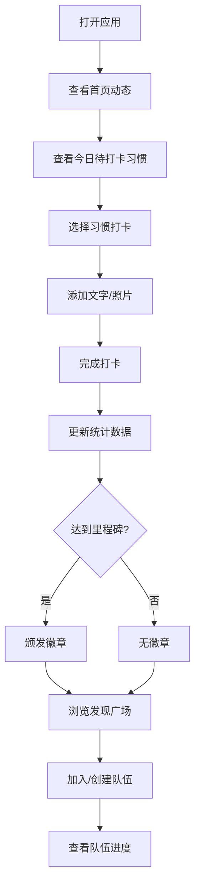

## 1. 产品概述

社交打卡习惯养成平台是一款帮助用户建立和维持良好习惯的应用，通过打卡记录、数据统计、社交互动和游戏化机制，激励用户坚持完成个人目标。目标用户为希望培养自律习惯、追求自我提升的年轻人群体。产品核心价值在于将个人习惯养成转化为可分享的社交体验，通过好友监督和徽章成就系统提升用户粘性。

## 2. 核心功能

### 2.1 用户角色

| 角色 | 注册方式 | 核心权限 |
|------|----------|----------|
| 普通用户 | 手机号/邮箱注册 | 创建习惯、打卡记录、关注好友、发布动态、加入队伍 |

### 2.2 功能模块

1. **首页动态**：关注好友打卡动态、点赞评论互动、今日打卡提醒
2. **习惯管理**：创建/编辑习惯计划、设置频率提醒、打卡有效窗口
3. **打卡功能**：文字感想、照片记录、快速打卡
4. **数据统计**：连续打卡天数、本月完成率、历史总次数、热力日历
5. **好友社交**：关注/取关、用户搜索、个人主页
6. **发现广场**：精选公开打卡内容、热门用户推荐
7. **徽章系统**：7天/30天/100天里程碑徽章、成就展示
8. **组队挑战**：创建/加入队伍、队伍完成进度、每日统计
9. **消息中心**：打卡提醒、激励文案、互动通知

### 2.3 页面详情

| 页面名称 | 模块名称 | 功能描述 |
|----------|----------|----------|
| 登录注册页 | 登录表单 | 手机号/邮箱登录、验证码验证 |
| 登录注册页 | 注册表单 | 用户信息填写、头像上传 |
| 首页动态 | 动态列表 | 好友打卡动态、时间线展示 |
| 首页动态 | 互动操作 | 点赞、评论、转发 |
| 习惯列表 | 习惯卡片 | 今日待打卡习惯、完成状态 |
| 习惯详情 | 统计面板 | 连续天数、完成率、热力图 |
| 习惯详情 | 打卡记录 | 历史记录列表、照片展示 |
| 创建习惯 | 表单配置 | 习惯名称、图标选择、频率设置 |
| 创建习惯 | 提醒设置 | 提醒时间、有效窗口、重复周期 |
| 打卡页 | 打卡表单 | 文字感想、照片上传、心情标记 |
| 用户主页 | 个人信息 | 头像、昵称、简介、徽章展示 |
| 用户主页 | 习惯统计 | 个人所有习惯数据概览 |
| 发现广场 | 内容流 | 公开精选打卡、热门推荐 |
| 发现广场 | 用户搜索 | 按昵称搜索、推荐关注 |
| 队伍列表 | 队伍卡片 | 队伍信息、成员列表、完成进度 |
| 队伍详情 | 每日统计 | 队员打卡情况、队伍排名 |
| 创建队伍 | 队伍表单 | 名称、目标、邀请码设置 |
| 消息中心 | 通知列表 | 系统通知、互动提醒、激励文案 |

## 3. 核心流程

用户打开应用后，首先查看首页动态了解好友最新打卡情况，然后查看今日待打卡习惯列表。选择一个习惯进行打卡，可添加文字感想或照片。完成打卡后系统自动更新连续天数和统计数据，可能触发徽章奖励。用户可浏览发现广场获取灵感，或加入组队挑战与好友共同进步。

## 4. 用户界面设计

### 4.1 设计风格

- **主色调**：渐变绿色系（#10b981 到 #059669），象征成长与活力
- **辅助色**：温暖橙色（#f59e0b）用于徽章和重要提醒，淡紫色（#8b5cf6）用于社交互动
- **中性色**：深灰（#1f2937）文字，浅灰（#f3f4f6）背景，白色卡片
- **按钮风格**：圆角12px，渐变填充，悬停时有轻微上浮阴影效果
- **字体**：标题使用"Noto Sans SC" 700，正文使用"Inter" 400/500
- **布局风格**：卡片式布局，柔和阴影，充足留白，左右分栏桌面端设计
- **图标**：lucide-react线性图标，统一18px尺寸，与文字对齐
- **动效**：页面切换淡入淡出，按钮点击缩放反馈，卡片悬停轻微上浮

### 4.2 页面设计概述

| 页面名称 | 模块名称 | UI元素 |
|----------|----------|--------|
| 首页动态 | 顶部导航 | Logo、搜索框、消息图标、用户头像 |
| 首页动态 | 侧边栏 | 习惯列表快捷入口、好友列表 |
| 首页动态 | 动态流 | 打卡卡片（头像、习惯名、文字、照片、点赞评论数） |
| 习惯详情 | 统计概览 | 三个数据卡片（连续天数、完成率、总次数） |
| 习惯详情 | 热力日历 | GitHub风格贡献图，近一年打卡密度 |
| 习惯详情 | 记录列表 | 时间线展示历史打卡记录 |
| 创建习惯 | 表单项 | 分组标签页（基本信息、提醒设置、高级选项） |
| 打卡页 | 打卡表单 | 大尺寸打卡按钮、文本域、照片上传区、心情选择器 |
| 用户主页 | 头部区域 | 封面图、头像、昵称、简介、关注按钮 |
| 用户主页 | 徽章墙 | 网格展示获得的徽章，未获得显示为灰色 |
| 发现广场 | 内容瀑布流 | 双列卡片布局，精选公开打卡内容 |
| 队伍详情 | 进度面板 | 环形进度条、队员打卡状态列表、每日排名 |
| 消息中心 | 通知项 | 图标、标题、时间、已读/未读状态 |

### 4.3 响应式

- **桌面端（>1024px）**：三栏布局，左侧导航、中间内容、右侧推荐
- **平板端（768-1024px）**：两栏布局，可收起侧边栏
- **移动端（<768px）**：单栏布局，底部Tab导航，内容区域占满宽度
- 触摸优化：按钮最小尺寸44x44px，列表项垂直间距16px，支持下拉刷新和上滑加载

