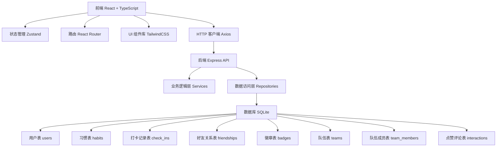
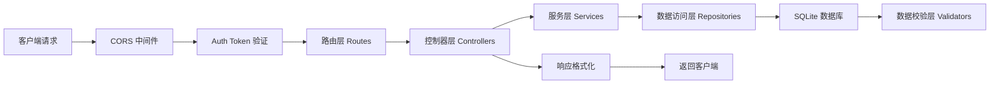
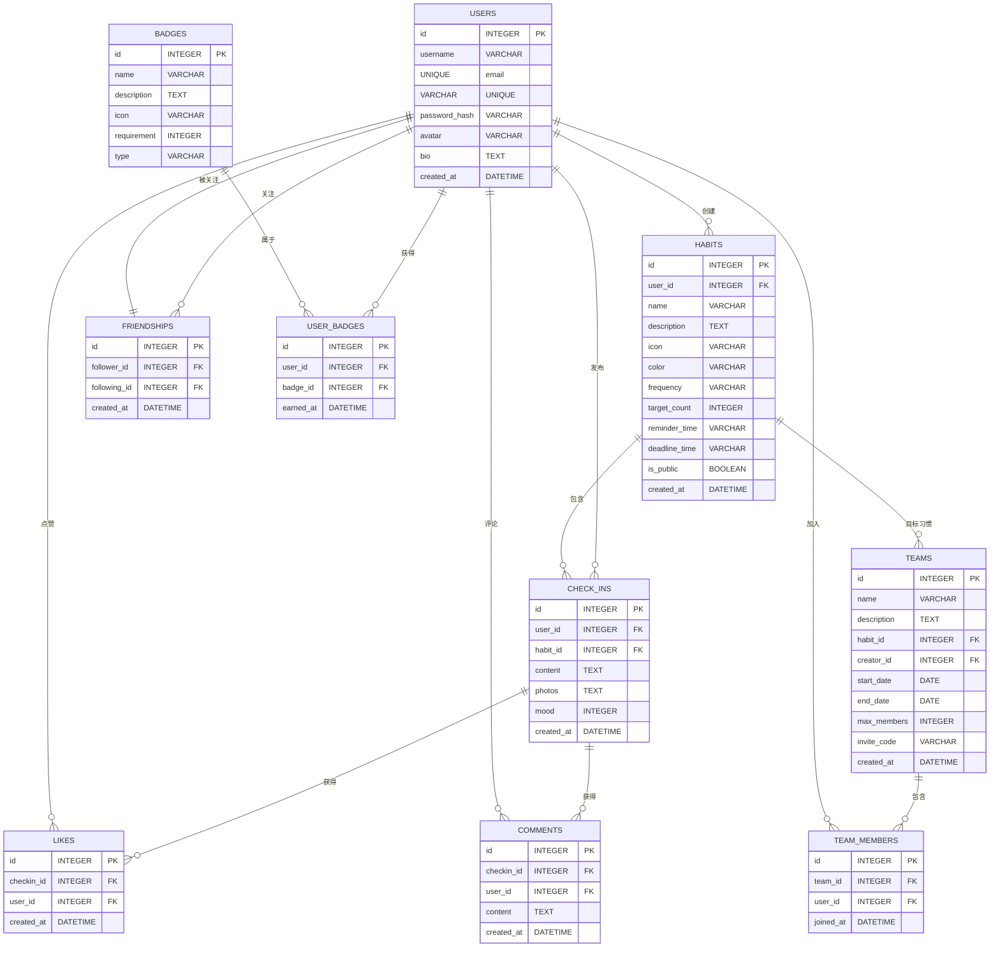

## 1. 架构设计



## 2. 技术描述

- **前端**：React@18 + TypeScript + Vite + TailwindCSS@3 + Zustand + React Router DOM@6 + Lucide React
- **初始化工具**：vite-init react-express-ts 模板
- **后端**：Express@4 + TypeScript + CORS + bcryptjs
- **数据库**：SQLite3 + better-sqlite3，本地存储无需额外服务
- **图标**：lucide-react
- **状态管理**：Zustand 管理用户状态、习惯数据、动态数据
- **HTTP 客户端**：Axios 统一封装请求拦截器

## 3. 路由定义

| 路由 | 页面 | 说明 |
|------|------|------|
| /login | 登录页 | 未登录用户访问 |
| /register | 注册页 | 新用户注册 |
| / | 首页动态 | 登录后默认页 |
| /habits | 习惯列表 | 所有习惯概览 |
| /habits/create | 创建习惯 | 新建习惯计划 |
| /habits/:id | 习惯详情 | 单个习惯统计和记录 |
| /habits/:id/checkin | 打卡页 | 完成打卡 |
| /users/:id | 用户主页 | 查看用户信息 |
| /explore | 发现广场 | 公开内容浏览 |
| /teams | 队伍列表 | 已加入和推荐队伍 |
| /teams/create | 创建队伍 | 新建组队挑战 |
| /teams/:id | 队伍详情 | 队伍进度和成员 |
| /messages | 消息中心 | 通知和提醒 |
| /profile | 个人中心 | 当前用户信息设置 |

## 4. API 定义

### 用户接口
```typescript
// POST /api/auth/register
interface RegisterRequest {
  username: string;
  email: string;
  password: string;
  avatar?: string;
}
interface RegisterResponse {
  id: number;
  username: string;
  token: string;
}

// POST /api/auth/login
interface LoginRequest {
  email: string;
  password: string;
}

// GET /api/users/:id
interface UserProfile {
  id: number;
  username: string;
  avatar: string;
  bio: string;
  totalCheckIns: number;
  currentStreak: number;
  followersCount: number;
  followingCount: number;
  badges: Badge[];
  isFollowing: boolean;
}
```

### 习惯接口
```typescript
// POST /api/habits
interface CreateHabitRequest {
  name: string;
  description: string;
  icon: string;
  color: string;
  frequency: 'daily' | 'weekly';
  targetCount: number;  // 每周次数或每日次数
  reminderTime: string;
  deadlineTime: string;  // 有效窗口截止时间
  isPublic: boolean;
}

// GET /api/habits
interface HabitListResponse {
  habits: Habit[];
  todayProgress: { habitId: number; completed: boolean }[];
}

// GET /api/habits/:id
interface HabitDetail {
  id: number;
  name: string;
  icon: string;
  color: string;
  currentStreak: number;
  longestStreak: number;
  monthlyCompletionRate: number;
  totalCheckIns: number;
  checkInHistory: CheckIn[];
  heatmapData: { date: string; count: number }[];
}
```

### 打卡接口
```typescript
// POST /api/checkins
interface CheckInRequest {
  habitId: number;
  content?: string;
  photos?: string[];
  mood?: number;  // 1-5
}

// GET /api/checkins/feed
interface FeedResponse {
  checkIns: CheckInFeed[];
  nextCursor: number;
}

interface CheckInFeed {
  id: number;
  userId: number;
  username: string;
  avatar: string;
  habitId: number;
  habitName: string;
  habitIcon: string;
  content: string;
  photos: string[];
  mood: number;
  createdAt: string;
  likesCount: number;
  commentsCount: number;
  isLiked: boolean;
}
```

### 社交接口
```typescript
// POST /api/friendships/:userId/follow
// DELETE /api/friendships/:userId/unfollow

// POST /api/checkins/:id/like
// POST /api/checkins/:id/comments
interface CommentRequest {
  content: string;
}

// GET /api/explore
interface ExploreResponse {
  featured: CheckInFeed[];
  trending: CheckInFeed[];
  suggestedUsers: UserProfile[];
}
```

### 队伍接口
```typescript
// POST /api/teams
interface CreateTeamRequest {
  name: string;
  description: string;
  targetHabitId: number;
  startDate: string;
  endDate: string;
  maxMembers: number;
}

// GET /api/teams/:id
interface TeamDetail {
  id: number;
  name: string;
  members: TeamMember[];
  dailyProgress: { date: string; completionRate: number }[];
  todayCompleted: number;
  totalMembers: number;
}
```

## 5. 服务器架构图



## 6. 数据模型

### 6.1 数据模型定义



### 6.2 数据定义语言

```sql
-- 用户表
CREATE TABLE users (
  id INTEGER PRIMARY KEY AUTOINCREMENT,
  username VARCHAR(50) UNIQUE NOT NULL,
  email VARCHAR(100) UNIQUE NOT NULL,
  password_hash VARCHAR(255) NOT NULL,
  avatar VARCHAR(255),
  bio TEXT,
  created_at DATETIME DEFAULT CURRENT_TIMESTAMP
);

-- 习惯表
CREATE TABLE habits (
  id INTEGER PRIMARY KEY AUTOINCREMENT,
  user_id INTEGER NOT NULL,
  name VARCHAR(100) NOT NULL,
  description TEXT,
  icon VARCHAR(50) DEFAULT 'target',
  color VARCHAR(20) DEFAULT '#10b981',
  frequency VARCHAR(20) DEFAULT 'daily',
  target_count INTEGER DEFAULT 1,
  reminder_time VARCHAR(10),
  deadline_time VARCHAR(10) DEFAULT '22:00',
  is_public BOOLEAN DEFAULT 0,
  created_at DATETIME DEFAULT CURRENT_TIMESTAMP,
  FOREIGN KEY (user_id) REFERENCES users(id)
);

-- 打卡记录表
CREATE TABLE check_ins (
  id INTEGER PRIMARY KEY AUTOINCREMENT,
  user_id INTEGER NOT NULL,
  habit_id INTEGER NOT NULL,
  content TEXT,
  photos TEXT,
  mood INTEGER CHECK(mood BETWEEN 1 AND 5),
  created_at DATETIME DEFAULT CURRENT_TIMESTAMP,
  FOREIGN KEY (user_id) REFERENCES users(id),
  FOREIGN KEY (habit_id) REFERENCES habits(id)
);

-- 好友关系表
CREATE TABLE friendships (
  id INTEGER PRIMARY KEY AUTOINCREMENT,
  follower_id INTEGER NOT NULL,
  following_id INTEGER NOT NULL,
  created_at DATETIME DEFAULT CURRENT_TIMESTAMP,
  FOREIGN KEY (follower_id) REFERENCES users(id),
  FOREIGN KEY (following_id) REFERENCES users(id),
  UNIQUE(follower_id, following_id)
);

-- 徽章表
CREATE TABLE badges (
  id INTEGER PRIMARY KEY AUTOINCREMENT,
  name VARCHAR(50) NOT NULL,
  description TEXT,
  icon VARCHAR(50) NOT NULL,
  requirement INTEGER NOT NULL,
  type VARCHAR(20) NOT NULL
);

-- 用户徽章表
CREATE TABLE user_badges (
  id INTEGER PRIMARY KEY AUTOINCREMENT,
  user_id INTEGER NOT NULL,
  badge_id INTEGER NOT NULL,
  earned_at DATETIME DEFAULT CURRENT_TIMESTAMP,
  FOREIGN KEY (user_id) REFERENCES users(id),
  FOREIGN KEY (badge_id) REFERENCES badges(id),
  UNIQUE(user_id, badge_id)
);

-- 队伍表
CREATE TABLE teams (
  id INTEGER PRIMARY KEY AUTOINCREMENT,
  name VARCHAR(100) NOT NULL,
  description TEXT,
  habit_id INTEGER,
  creator_id INTEGER NOT NULL,
  start_date DATE NOT NULL,
  end_date DATE NOT NULL,
  max_members INTEGER DEFAULT 20,
  invite_code VARCHAR(20) UNIQUE,
  created_at DATETIME DEFAULT CURRENT_TIMESTAMP,
  FOREIGN KEY (habit_id) REFERENCES habits(id),
  FOREIGN KEY (creator_id) REFERENCES users(id)
);

-- 队伍成员表
CREATE TABLE team_members (
  id INTEGER PRIMARY KEY AUTOINCREMENT,
  team_id INTEGER NOT NULL,
  user_id INTEGER NOT NULL,
  joined_at DATETIME DEFAULT CURRENT_TIMESTAMP,
  FOREIGN KEY (team_id) REFERENCES teams(id),
  FOREIGN KEY (user_id) REFERENCES users(id),
  UNIQUE(team_id, user_id)
);

-- 点赞表
CREATE TABLE likes (
  id INTEGER PRIMARY KEY AUTOINCREMENT,
  checkin_id INTEGER NOT NULL,
  user_id INTEGER NOT NULL,
  created_at DATETIME DEFAULT CURRENT_TIMESTAMP,
  FOREIGN KEY (checkin_id) REFERENCES check_ins(id),
  FOREIGN KEY (user_id) REFERENCES users(id),
  UNIQUE(checkin_id, user_id)
);

-- 评论表
CREATE TABLE comments (
  id INTEGER PRIMARY KEY AUTOINCREMENT,
  checkin_id INTEGER NOT NULL,
  user_id INTEGER NOT NULL,
  content TEXT NOT NULL,
  created_at DATETIME DEFAULT CURRENT_TIMESTAMP,
  FOREIGN KEY (checkin_id) REFERENCES check_ins(id),
  FOREIGN KEY (user_id) REFERENCES users(id)
);

-- 消息通知表
CREATE TABLE notifications (
  id INTEGER PRIMARY KEY AUTOINCREMENT,
  user_id INTEGER NOT NULL,
  type VARCHAR(50) NOT NULL,
  content TEXT NOT NULL,
  related_id INTEGER,
  is_read BOOLEAN DEFAULT 0,
  created_at DATETIME DEFAULT CURRENT_TIMESTAMP,
  FOREIGN KEY (user_id) REFERENCES users(id)
);

-- 初始化徽章数据
INSERT INTO badges (name, description, icon, requirement, type) VALUES
('初露锋芒', '连续打卡7天', 'flame', 7, 'streak'),
('坚持不懈', '连续打卡30天', 'trophy', 30, 'streak'),
('习惯大师', '连续打卡100天', 'crown', 100, 'streak'),
('早起达人', '累计早起打卡100次', 'sunrise', 100, 'total'),
('健身达人', '累计健身打卡50次', 'dumbbell', 50, 'total'),
('阅读达人', '累计阅读打卡50次', 'book-open', 50, 'total');
```

